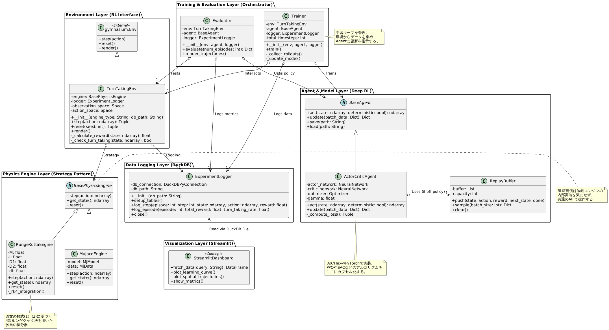

# Turn-taking with Deep Reinforcement Learning

## About

本プロジェクトでは[Adaptability and Diversity in Simulated Turn-taking Behaviour](https://arxiv.org/abs/nlin/0310041)に対して、遺伝的アルゴリズムを使わずに深層強化学習を用いたエージェントの振る舞いを実験することを目的とする。本文書では、まず論文のモデルについて説明を行い、次にモデルに対して遺伝的深層強化学習に置き換えた場合のロジックについてアイディアを述べる。最後に、実装を行うための設計(クラス図、DBのスキーマ)について述べる。

## Original model

### 環境とエージェントの身体構造

エージェントは半径$R$の円形の身体を持ち、左右の車輪(モーター)から生み出される力によって、無限の2次元平面上を移動する。エージェントの向いている角度を $\theta$、その方向への速度を $v$ とすると、運動方程式は以下になる。

$$
M\dot{v} + D_1v + f_1 + f_2 = 0
$$

$$
I\ddot{\theta} + D_2\dot{\theta} + \tau(f_1, f_2) = 0
$$


ここで、$f_1$、 $f_2$ は左右のモーターが生成する前進駆動力、$\tau$ はトルク、$M$ は質量、$I$ は慣性モーメント、$D_1$、$D_2$ は抵抗係数を表す。シミュレーションでは、これらをルンゲ＝クッタ法（Runge-Kutta method）を用いて反復的に解く。ターンの定義は、相手の背後(Rear Side: RS)に入った場合、そのエージェントの"ターン"とみなされる。RSは距離 $r$ と角度 $\phi$ をパラメータとする扇形の領域のとして定義される。

### ニューラルネットワーク(Brain)

エージェントの意思決定と運動生成は、3層のリカレント・ニューラル・ネットワーク(RNN)で行われる。ネットワーク構造は以下の４層からなる。

*   **入力層 (Input, 3ノード)**: 自分から見た相手の相対位置（距離と角度）、および相手の向いている角度。
*   **中間層 (Hidden, 10ノード)**: 入力層およびコンテキスト層からの信号を処理する。
*   **コンテキスト層 (Context, 3ノード)**: 1ステップ前の中間層の状態を保持し、内部ダイナミクスを形成する。
*   **出力層 (Output)**:
    *   **モーター出力 (Motor, 2ノード)**: $f_1, f_2$ を出力します。
    *   **予測出力 (Prediction, 3ノード)**: 次のステップにおける相手の相対位置などを予測する。

各タイムステップ $t$ における計算式は以下の通りである（$g(x)$ はシグモイド関数）。

$$ h_j(t) = g\left( \sum_i w_{ij}y_i(t) + \sum_l w'_{lj}c_l(t-1) + b_{j1} \right) $$
$$ z_k(t) = g\left( \sum_j u_{jk}h_j(t) + b_{j2} \right) $$
$$ c_l(t) = g\left( \sum_l u'_{jl}h_j(t) + b_{j3} \right) $$
$$ g(x) = \frac{1}{1 + \exp(-x)} $$

## 遺伝的アルゴリズム (GA) と適応度 (Fitness)

エージェント同士が同じ遺伝子になるのを防ぐため、2つの独立した集団（Population A, B）を用意し、各集団から1体ずつ選んでペアにして評価する。適応度 $F_a$ は、「ターンテイキングの成立度（$F_{turn_a}$）」と「予測の正確さ（$F_{predict_a}$）」の和で計算される。

$$ F_a = \frac{1}{P} \sum_P \left( s_1 \times F_{turn_a} + s_2 \times F_{predict_a} \right) $$

**ターンテイキングの評価** ($F_{turn_a}$)
双方が交互に相手の $RS$ に入り合うことでスコアが高くなる。
$$ F_{turn_a} = \sum_{t=1}^T g_a(t) \times \sum_{t=1}^T g_b(t) $$
$$ g_a(t) = \begin{cases} 1 & \text{if } Pos_a(t) \in RS_b(t) \\ 0 & \text{otherwise} \end{cases} $$

**予測の正確さの評価** ($F_{predict_a}$)
予測位置（$Pos_{a \to b}$）と実際の位置（$Pos_b$）の誤差（二乗誤差 $P_a$）が少ないほど評価される。
$$ F_{predict_a} = - \sum_{t=1}^T P_a(t) \times \sum_{t=1}^T P_b(t) $$
$$ P_a(t) = (Pos_b(t) - Pos_{a \to b}(t))^2 $$

評価時間 $T$ は、エージェントが終わりを予測できないよう、$500, 1000, 1500$ のように変動させる。

上記のアルゴリズムの疑似コードは以下である。物理演算のタイムスケール（$\Delta T_1$）とニューラルネットのタイムスケール（$\Delta T_2$）が異なり、RNNはルンゲ＝クッタ法の100ステップに1回の頻度で計算される。また、入力には毎ステップ、ランダムなノイズが付加される。

```python
def main():
    # GAの個体数 P=15 で初期化
    population_A = initialize_population(size=15)
    population_B = initialize_population(size=15)
    
    for generation in range(MAX_GENERATIONS):
        # 全ての組み合わせ (P x P) で評価
        for agent_a in population_A:
            for agent_b in population_B:
                # 評価時間 T = 500, 1000, 1500 のいずれか
                T = random_choice()
                
                score_a, score_b = run_episode(agent_a, agent_b, T)
                agent_a.add_fitness(score_a)
                agent_b.add_fitness(score_b)
        
        # エリート選択 (E=4) による次世代生成
        population_A = evolve_population(population_A, elite_size=4)
        population_B = evolve_population(population_B, elite_size=4)

def run_episode(agent_a, agent_b, total_time_steps):
    reset_environment(agent_a, agent_b)
    history_a, history_b = [], []
    
    for t in range(total_time_steps):
        # --- センサ入力とRNNの更新 (100物理ステップに1回) ---
        if t % 100 == 0: 
            # 入力情報の取得 + ランダムノイズの付加
            input_a = get_relative_state(agent_a, agent_b) + generate_noise()
            input_b = get_relative_state(agent_b, agent_a) + generate_noise()
            
            # RNNの順伝播計算
            motor_a, pred_a = agent_a.rnn_forward(input_a)
            motor_b, pred_b = agent_b.rnn_forward(input_b)
        
        # --- 物理状態の更新 (毎ステップ) ---
        agent_a.update_physics_RungeKutta(motor_a)
        agent_b.update_physics_RungeKutta(motor_b)
        
        # --- 評価用データの記録 ---
        is_a_in_b_rear = check_in_rear_side(agent_a, agent_b) 
        is_b_in_a_rear = check_in_rear_side(agent_b, agent_a)
        
        pred_error_a = calculate_squared_error(pred_a, agent_b.actual_state)
        pred_error_b = calculate_squared_error(pred_b, agent_a.actual_state)
        
        history_a.append({"turn": is_a_in_b_rear, "err": pred_error_a})
        history_b.append({"turn": is_b_in_a_rear, "err": pred_error_b})
        
    # 適応度の計算
    fitness_a = calculate_total_fitness(history_a, history_b)
    fitness_b = calculate_total_fitness(history_b, history_a)
    
    return fitness_a, fitness_b
```

## Deep Reinforcement Learning based model

論文では遺伝的アルゴリズム(Genetic Algorithm, GA)を用いてモデルのパラメータを計算している。また、物理モデルの計算に4次のルンゲクッタを用いている。これに対して、以下の変更を加えたものを実装する。

1. 遺伝的アルゴリズムではなく、深層強化学習を用いてモデルのパラメータを求める。
2. ルンゲクッタによる物理モデルと[MuJoCo](https://mujoco.org/)などを用いた物理シミュレーションによるモデルを切り替え可能とする。
3. モデルは論文中のRNNを含めて変更可能とする(設定ファイルなどで)

### 方針

深層強化学習（DRL）の問題として定式化する場合、連続空間での2エージェントによる相互作用であるため、**「連続値制御を伴うマルチエージェント強化学習（MARL）」**としてアプローチすることを考える。

### 手法・アルゴリズムの選定

*   **状態と行動の連続性:** エージェントはモーターの出力（$f_1, f_2$）という連続値を制御する。そのため、離散値向けのDQNではなく、[PPO（Proximal Policy Optimization）](https://horomary.hatenablog.com/entry/2020/10/18/225833)や[SAC（Soft Actor-Critic）](https://horomary.hatenablog.com/entry/2020/12/20/115439)、あるいはマルチエージェント拡張である[MADDPG（Multi-Agent Deep Deterministic Policy Gradient）](https://qiita.com/mayudong200333/items/4a09a52e58a66a766ab2)などが適している。
*   **RNNの統合:** 資料のモデルではリカレントニューラルネットワーク（RNN）を用いて内部状態を保持しています。DRLでもこれを踏襲し、ActorネットワークとCriticネットワークの双方にLSTMやGRUといった再帰層を組み込む（Recurrent PPOなど）必要がある。
*   **集団の扱い:** 資料のGAでは、同一の戦略への偏りを防ぐために「2つの独立した集団（Population AとB）」を用意しています。DRLでは、2つの独立した方策ネットワークを同時に学習させるか、セルフプレイ（Self-Play）環境を構築して学習を進めることになる。

### 報酬関数（Reward）の設計

GAではエピソード全体の「ターンテイキングの成立度」を適応度として最後にまとめて評価している。しかし、DRLではこれを各ステップの報酬 $r_t$ として設計する必要がある。

*   **基本報酬:** 相手の背後（RS: Rear Side）に入ったステップでプラスの報酬を与える。
*   **ターンテイキングを促す遅延報酬:** 資料では「一方が独占するのではなく、双方が掛け算的に交代する」ことを高く評価している。これをDRLで実現するには、「直近で相手がRSに入っていた時間」を状態として保持し、**役割が交代（スイッチ）した瞬間に大きなボーナス報酬**を与えるなどの工夫が必要である。

### ロス関数と最適化（Loss Function & Optimization）

資料の適応度（Fitness）は、「ターンテイキングの評価」と「予測の正確さの評価」の和で構成されている。DRLでは、この「予測」部分を**補助タスク（Auxiliary Task）**のロス関数として組み込む手法が有効である。

全体のロス関数 $\mathcal{L}_{total}$ は以下のように設計できる。

$$ \mathcal{L}_{total} = \mathcal{L}_{policy} + \alpha \mathcal{L}_{value} + \beta \mathcal{L}_{predict} $$

1.  **方策ロス ($\mathcal{L}_{policy}$):**
    エージェントが期待収益（報酬の合計）を最大化するように、行動（モーター出力）の確率分布を更新するロスである（例：PPOのクリップ関数を用いたロス）。
2.  **価値関数ロス ($\mathcal{L}_{value}$):**
    Criticネットワークが、現在の状態から得られる将来の報酬予測（状態価値）を正確に推定するための誤差（二乗誤差など）である。
3.  **予測ロス / 補助タスク ($\mathcal{L}_{predict}$):**
    資料のGAモデルでは、相手の1ステップ先の相対位置を予測し、実際の位置との二乗誤差を適応度に反映させている。DRLでは、これを自己教師あり学習の補助ロスとして活用する。
    *   $\mathcal{L}_{predict} = \text{MSE}(Pos_b(t) - Pos_{a \to b}(t))$
    *   この予測ロスをネットワークの共通の隠れ層（RNNの中間層など）に逆伝播させることで、単に報酬を追うだけでなく、「相手の意図や動きのダイナミクスを理解する表現能力」の学習を加速させることができる。

### 最適化（Optimization）

GAでは世代ごとにエリートを選択し、突然変異を加えて重みを更新する。DRLに置き換えた場合、エージェントが環境で行動して得た経験（状態、行動、報酬、予測値）をリプレイバッファなどに保存し、**Adamなどの勾配降下法に基づくオプティマイザ**を用いて、上記の総ロス $\mathcal{L}_{total}$ を最小化するようにネットワークのパラメータを微調整していくことになる。

## Idea of architecture

以下の図のようなクラス構造とする。

